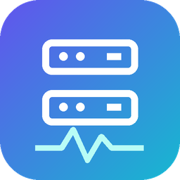

# ServerStatus-Plugin · 服务器状态

框架独立的 **Linux 宿主机**状态采集、JSON 接口、PNG 看板与可选定时清理。附带 Yunzai V3 命令适配器；其他机器人框架可通过 CLI 或 Node.js API 接入。

核心无云崽安装前提。独立 JSON CLI 只使用 Python 标准库；PNG 需要 Pillow 和中文字体。**通用核心不等于已提供所有框架的安装即用适配器**：当前现成适配器仅为 Yunzai V3，NoneBot、AstrBot 等需按[适配协议](docs/ADAPTERS.md)接入。宿主机采集不支持 Windows/macOS。


## 独立运行

```bash
git clone https://github.com/719083594/ServerStatus-Plugin.git
cd ServerStatus-Plugin
python3 scripts/status.py --application-root /srv/my-application --kind resources --format json
```

PNG 依赖（Debian/Ubuntu）：

```bash
sudo apt-get install python3-pil fonts-wqy-microhei
python3 scripts/status.py --application-root /srv/my-application \
  --kind all --format both --output /tmp/server-status.png
```

`--kind` 可选 `all/resources/storage/plugins/services`。标准输出始终为 `{kind, generatedAt, details, dimensions?, pngPath?}` JSON；PNG 路径每次覆盖。可用 `--config collector/config.json` 指定 Docker、数据目录和字体配置；不传配置也能运行。`--runtime runtime.json` 可传框架的真实运行数据，不传则显示未知，不会把缺少在线状态当成离线。

```js
import {collectSnapshot} from './index.js'
const report = await collectSnapshot({kind:'resources'})
console.log(report.details.memory)
```

Node.js 18+ API 会调用本机 `python3`，没有 npm 第三方依赖。JSON 模式无需采集守护服务。PNG 的 `format:'both', output:'/tmp/status.png'` 会附带 `report.png` Buffer。

## Yunzai 安装

在云崽根目录执行：

```bash
git clone https://github.com/719083594/ServerStatus-Plugin.git plugins/ServerStatus-Plugin
sudo python3 plugins/ServerStatus-Plugin/scripts/install.py \
  --application-root "$PWD" --integration yunzai --application-user "$(id -un)" \
  --install-deps --systemd --docker-mode off
```

安装器在本地写入 `config/integration.json` 选择适配器，源代码和 Git 跟踪文件保持完整，后续可正常 `git pull`。重启云崽后，以框架配置的主人发送：

| 命令（也支持 `/`） | 内容 |
| --- | --- |
| `#系统` / `#服务器` | 完整总览 |
| `#资源` | CPU、内存、Swap、运行时间、应用进程 |
| `#存储` | 磁盘、inode、数据目录、Docker 存储与清理结果 |
| `#插件` | 适配器提供的插件版本和实际加载计数 |
| `#服务` | Docker 容器状态与占用 |
| `#系统帮助` | 命令说明 |

支持具有 `lib/plugins/plugin.js`、`e.isMaster`、`e.reply`、`segment.image` 的 Yunzai V3 接口。非主人不会采集或回复。框架群消息限制、黑白名单仍生效。不调用 AI，不将系统信息发送到外部服务。

Docker 内机器人需要宿主机采集器与共享 IPC 目录，详见[完整安装说明](docs/INSTALL.md)。没有 Docker 或没有权限时仍能查看宿主机资源，服务页会诚实提示不可用。

## 定时清理

默认关闭。Docker“估算可回收”可能包含共享镜像层，以实际清理结果为准；状态图片每次覆盖，不会积累历史。

```bash
# 预览，不删除任何文件，不执行 Docker prune
python3 collector/cleanup.py --config collector/config.json
# Linux 宿主机显式启用：每天北京时间 03:30，最多延迟 5 分钟
sudo python3 scripts/install-cleanup.py --config collector/config.json --enable --time 03:30
```

固定范围：7 天以上未使用镜像、24 小时以上构建缓存（保留 1GB）、`applicationRoot/temp` 与 `applicationRoot/data/upload_tmp` 的 7 天以上普通文件、`applicationRoot/logs` 的 14 天以上已轮转日志。跳过隐藏文件、符号链接、硬链接和跨设备文件；不删除容器、数据卷、聊天记录、数据库、登录或配置。Docker 清理作用于宿主机全部 Docker 镜像/构建缓存，请在启用前了解[安全边界](SECURITY.md)。

服务为 `server-status.service`、`server-status-cleanup.service` 和 `server-status-cleanup.timer`。停用：`sudo systemctl disable --now server-status-cleanup.timer`，并将本地 `cleanup.enabled` 设为 `false`。

## 从旧版升级

原 `yunzai-server-status` 的 `yunzaiRoot` 配置和 `--yunzai-root` 参数继续兼容；新安装统一使用 `applicationRoot` 和 `ServerStatus-Plugin`。保留原 IPC 路径、collector 配置及 cleanup 参数，将整包放入 `plugins/ServerStatus-Plugin`，在 `config/integration.json` 写入 `{"adapter":"yunzai"}`。迁移 systemd 的 `ExecStart` 到新目录和通用服务名，再停用旧服务/定时器，避免重复执行。不要同时加载两个插件目录。

公开仓库不含本机配置、QQ 账号、服务器地址和凭据。ZIP 应完整解压为 `ServerStatus-Plugin`，只复制 JS 入口无法提供宿主机图片采集。

## 验证与许可

见[验证说明](docs/TESTING.md)、[安装说明](docs/INSTALL.md)和[适配协议](docs/ADAPTERS.md)。本项目继续采用 [PolyForm Noncommercial 1.0.0](LICENSE)；通用化不改变非商业许可条件。外部框架、Pillow、字体、Docker 依赖各自许可，不随包分发。
