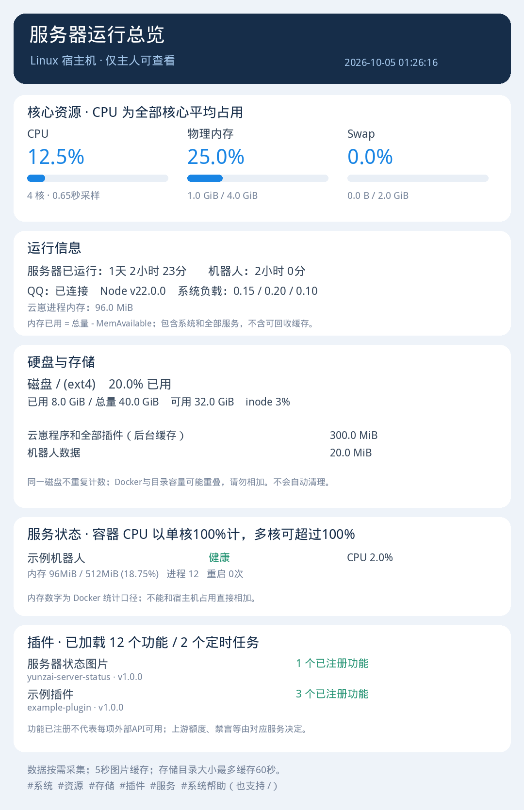

# 云崽服务器状态图片插件

主人发送一条命令，返回 Linux 宿主机的 CPU、内存、磁盘、服务和插件状态图片。**无需 AI、无需 API Key、无需 Chromium，不生成 AI 绘画，也不消耗模型额度。**



## 功能与命令

| 命令 | 返回内容 |
| --- | --- |
| `#系统` / `#服务器` | 完整状态总览图片 |
| `#资源` | CPU、物理内存、Swap、运行时间、负载、云崽进程内存 |
| `#存储` | 磁盘与 inode 使用率、程序和配置的数据目录容量、Docker 存储 |
| `#插件` | 插件目录、版本、框架提供的加载功能与定时任务数量 |
| `#服务` | Docker 服务健康状态、CPU、内存、进程数和重启次数 |
| `#系统帮助` | 简短命令说明 |

所有命令支持 `/`，例如 `/系统`。**仅框架配置的主人可以触发**，不写死 QQ 号码，不开放 HTTP 管理接口。框架自己的群消息限制、禁言和黑白名单仍然生效。

## 支持范围

- **框架**：按云崽 V3 插件接口设计，支持 TRSS-Yunzai / Miao-Yunzai 等具有 `lib/plugins/plugin.js`、`e.isMaster`、`e.reply`、全局 `segment.image` 的兼容框架。
- **系统**：采集器需要 Linux；Ubuntu/Debian 提供自动依赖安装。其他 Linux 可自行安装 Python/Pillow/中文字体。
- **部署**：支持原生 Node 部署和 Docker 内运行云崽；Docker 模式的采集器必须运行在**宿主机**，通过共享目录传递图片。
- Windows/macOS 宿主机、NoneBot、AstrBot、没有云崽插件接口的框架不在本版本支持范围内。
- 没有 Docker 时宿主机资源和插件图仍可用，服务页会明确提示 Docker 不可用；不把它当成整个插件失败。
- 框架没有提供插件计数或在线状态时显示“未知/未提供”，不伪装成 0 个功能或掉线。

## 完整安装

**本插件有一个必需的附属组件：包内的 Python 宿主机采集器。只复制 `index.js` 不能使用。** 发布包已包含它和安装/诊断工具，不需要安装其他机器人插件。

### Ubuntu/Debian 原生部署

在云崽根目录执行：

```bash
git clone https://github.com/719083594/yunzai-server-status.git plugins/yunzai-server-status
sudo python3 plugins/yunzai-server-status/scripts/install.py \
  --yunzai-root "$PWD" --bot-user "$(id -un)" \
  --install-deps --systemd --docker-mode off
```

安装脚本会检查框架、安装你显式选择的依赖，创建本地配置与 IPC 目录，安装开机启动的采集服务。然后**重启云崽**，用主人账号发送 `#系统`。

如果需要监测 Docker，改用 `--docker-mode auto`，并确保采集服务运行用户有 Docker 权限。原生示例的 `off` 避免没有 Docker 权限影响初次安装。

### Docker 部署

先阅读 [Docker 安装步骤](docs/INSTALL.md#docker-部署)，确认宿主机云崽目录与机器人内目录指向相同文件。采集器不要装在机器人容器内，避免得到错误的磁盘/CPU数据。

### ZIP 安装

下载 [Releases](https://github.com/719083594/yunzai-server-status/releases) 的 `yunzai-server-status-v1.0.0.zip`，将最外层 `yunzai-server-status` 文件夹完整解压到云崽 `plugins` 目录，再运行上面的安装命令（跳过 `git clone`）。

所有依赖、非 systemd 启动方式、权限和 Docker 路径示例见 [完整安装说明](docs/INSTALL.md)。

## 必须的支持组件

| 组件 | 用途 | 是否包含 |
| --- | --- | --- |
| 云崽兼容框架与 QQ 适配器 | 收取命令、识别主人、发送图片 | 使用你的现有框架 |
| `collector/collector.py` | 宿主机采集与 PNG 渲染 | **包内已包含，必须启动** |
| Python 3.10+ | 运行采集器与安装工具 | 操作系统安装 |
| Pillow | 图片渲染 | Ubuntu/Debian 可由安装器安装 |
| 中文字体 | 防止图片中文乱码 | 可由安装器安装，或指定 `fontPath` |
| `du` | 数据目录占用统计 | Linux coreutils |
| Docker CLI 与相应权限 | 可选的容器监测 | 未安装时可关闭该项 |
| systemd | 可选的后台开机启动 | 也可自行用进程管理器 |

## 常见问题

“采集超时/无法发图”先运行：

```bash
python3 plugins/yunzai-server-status/scripts/diagnose.py \
  --config plugins/yunzai-server-status/collector/config.json
systemctl status yunzai-server-status --no-pager
journalctl -u yunzai-server-status -n 30 --no-pager
```

确认机器人已重启、采集器已启动、双方 IPC 目录指向同一目录，并且机器人能读取其中图片。细节见 [故障排查](docs/INSTALL.md#故障排查)。

## 数据口径与资源

CPU 采用宿主机全部核心平均占用（最高 100%）；容器 CPU 的 100% 表示一个核心，二者口径不同。内存已用为 `MemTotal - MemAvailable`。同一磁盘去重；数据目录与 Docker 的容量可能重叠，不能相加。

相同面板缓存 5 秒，普通存储统计缓存 60 秒。完整程序目录每小时按需后台刷新；首次还没有统计结果时明确提示“统计中或无法读取”。只覆盖固定状态文件，不积累历史图。systemd 默认限制 128 MiB 内存、30% 单核 CPU。实际耗时随目录规模与服务器负载变化。

## 验证与隐私

权限、双前缀、图片消息段、并发请求隔离、缓存、超时及不同框架字段的回退有测试。已在 TRSS-Yunzai 的 Linux/Docker 环境验证实际图片生成与发送；其他兼容分支按接口支持，需要遵循安装检查，不能保证任意魔改版本都兼容。

公开包不包含真实 QQ 号、主机地址、私有部署路径、API Key、SSH 密钥、聊天历史或真实运行截图。预览是合成示例。实际安装后的状态数据留在本机，仅通过主人触发的回复发送。详见 [安全与隐私](SECURITY.md)。

## 许可：允许非商业复制、修改、分享，禁止商用

采用 [PolyForm Noncommercial 1.0.0](https://polyformproject.org/licenses/noncommercial/1.0.0)。允许符合该许可证的非商业使用、复制、修改和再分发；分享时保留 `LICENSE` 和 `NOTICE`。商业使用需另行取得权利人许可，不能把它改成允许商用的授权。

这里的说明是摘要，以 [LICENSE](LICENSE) 的完整条款为准；各外部依赖保留自己的许可证。这是源码公开的非商业软件，不标称为允许所有用途的 OSI 开源项目。
